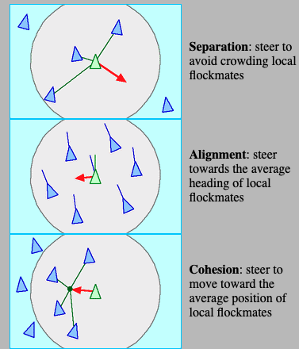
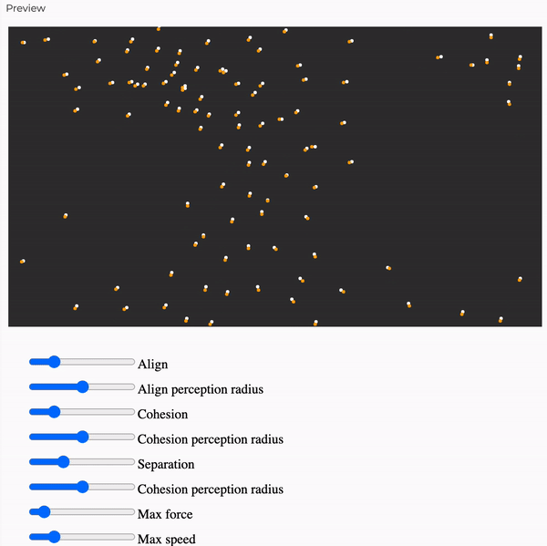

# Cellular automaton
## Game of Life
- See [documentation](https://en.wikipedia.org/wiki/Conway%27s_Game_of_Life).
- Implemented using Golang.

## Langton's ant
- See [documentation](https://en.wikipedia.org/wiki/Conway%27s_Game_of_Life).
- Implemented using [ps5js](https://p5js.org/).
- To make it works, just copy and paste the code [in this editor](https://editor.p5js.org/).

## Boids - Flocking simulation
- See [documentation](https://en.wikipedia.org/wiki/Boids) and [red3d](https://www.red3d.com/cwr/boids/).
- Consist of managing **separation**, **alignement**, and **cohesion**:
  

- Specificities:
  - Predators exist.
  - Predator get bigger and faster as they eat.
  - Flock is not stupid: they will try to avoid predator in their move.

- Implemented using [ps5js](https://p5js.org/).
- To make it works, just copy and paste the code [in this editor](https://editor.p5js.org/).

# Path search algorithm
## weighted A*
- See [documentation](https://en.wikipedia.org/wiki/A*_search_algorithm)
- A* is a graph traversal and path search algorithm, which is often used in many fields of computer science due to its completeness, optimality, and optimal efficiency.

- Implemented using [ps5js](https://p5js.org/).
- To make it works, just copy and paste the code [in this editor](https://editor.p5js.org/).
- 
